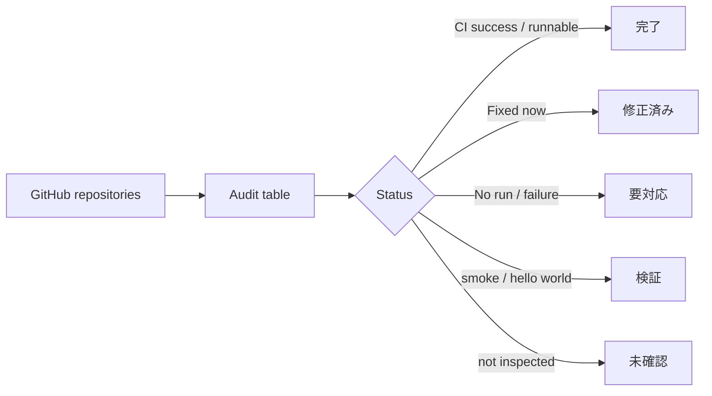

# Repository Completion Audit

univcorp2-ctrl 配下の公開リポジトリを、完成済み・修正済み・要対応・検証用・未確認に分けて見える化する中央ダッシュボードです。

## まず見る場所

- `docs/repository-status.md`: 人間向けの一覧表
- `repository-status.json`: 機械処理用の台帳
- `docs/architecture.md`: 判定方法と運用方針

## サマリー

| 区分 | 件数 | 意味 |
|---|---:|---|
| 完了 / 運用可能 | 10 | CI成功またはREADME・workflow・実行導線が揃っているもの |
| 修正済み / 再確認中 | 1 | 今回修正し、CI成功または収集workflowを再確認中のもの |
| 要対応 | 4 | workflow未実行・CI失敗・本番導線不足が見えたもの |
| 検証 / 雛形 | 6 | smoke test、hello world、テスト用repo |
| 未確認 | 12 | 公開一覧では存在確認済みだが、今回は中身・CIまで未確定のもの |

## 今回自動化したこと

- `global-job-aggregator-mvp` の collector / CLI / FastAPI / CI / collect workflow を修正
- `repository-completion-audit` を台帳リポジトリとして完成
- CIで `repository-status.json` の妥当性を検証

## 次の優先対応

1. `real-estate-sender-automation`: workflow run が見つからないためCI/README/実行手順の補完が必要
2. `gmail-sheets-property-mailer`: workflow run が見つからないためCI/README/実行手順の補完が必要
3. `github-full-automation`: 最新workflowが failure のため、ログ取得可能化またはworkflow再設計が必要
4. `crypto-auto-trade-sim`: 本体CIは成功だが、open PR があるため取り込み/クローズ判断が必要

