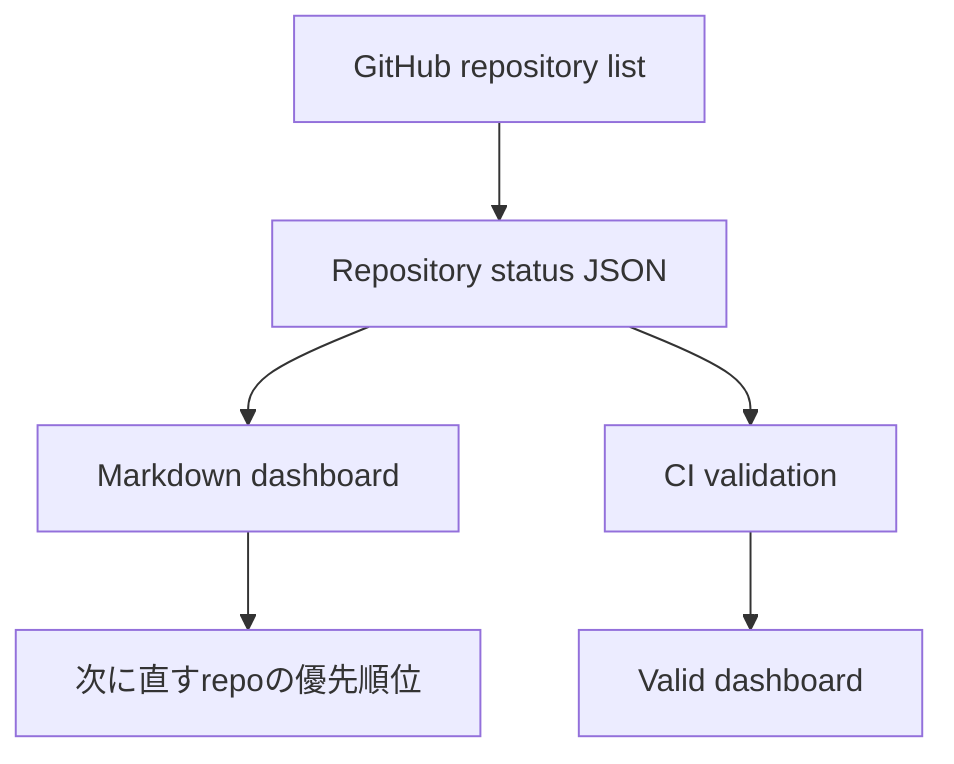

# Architecture

`repository-completion-audit` は、GitHub上の複数リポジトリを人間が迷わず把握するための静的な監査台帳です。

## 入力

- GitHub公開リポジトリ一覧
- README / workflow / tests / docs の有無
- GitHub Actionsの最新run結果

## 出力

- `docs/repository-status.md`: 人間向け一覧
- `repository-status.json`: 機械処理向け一覧
- `README.md`: 入口と要約

## CI

`.github/workflows/ci.yml` は以下を検証します。

1. JSONが読み込めること
2. `total_repositories` と配列件数が一致すること
3. 各repoに `name`, `program`, `status`, `ci`, `action` があること
4. 少なくとも1件の `needs_attention` が残っていること

## 運用方針

- CI成功済みのrepoは「完了 / 運用可能」とする
- workflow未実行や失敗は「要対応」とする
- hello world / smoke test / scaffold は本番プログラムと混ぜず「検証 / 雛形」とする
- 自動操作bot系はAPI利用可否と利用規約を確認してから本番扱いにする
